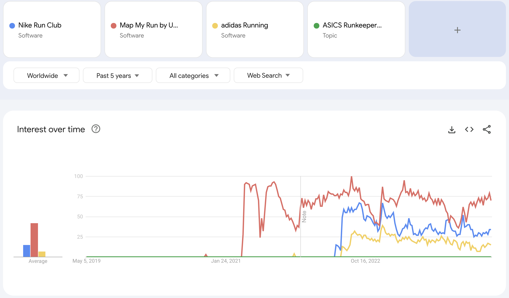

# Capstone Project - Zoom Ally: A Running Form Classifier (Overstriding)

> Author: Lee Hongwei
---

## Context:

### Popularity in Recreational Running

The recreational appeal of running has surged in recent times, especially from the [post-pandemic running boom](https://worldathletics.org/news/press-releases/global-running-day-research-nielsen). While specific data on running participation is challenging to retrieve, the projected market size of running [shoes](https://www.thebusinessresearchcompany.com/report/running-shoes-global-market-report) and [apparel](https://www.linkedin.com/pulse/running-apparel-market-size-research-report-2024-2032114-on2nc/) is expected to increase by a CAGR (Compound Annual Growth Rate) of 14.2% by [2032](https://www.marketresearchfuture.com/reports/running-gears-market-4346).
Even close to home in Singapore, the Standard Chartered Singapore marathon saw an increase in participants of 10% from [2022](https://www.sportplus.sg/post/standard-chartered-singapore-marathon-2022-celebrates-return-with-close-to-40-000-runners) to [2023](https://www.sportplus.sg/post/standard-chartered-singapore-marathon-2023-witnesses-over-44-000-runners-take-to-singapore-s-streets)

### Increase of use of Running Apps

With the intensified global take-up of recreational running, there are undoubtedly more amateur runners who lack access to proper guidance from fitness experts and coaches. Running apps fill that gap by providing necessary information and help track a runner's performance based on distance and speed, while the compatibility of smartwatches helps them track metrics such as calorie expenditure, intake and heartrate zones. [source](https://reports.valuates.com/market-reports/QYRE-Auto-13O2550/global-running-apps)

*The chart above shows the projected market size of the running apps market in 2027*

As of 2024, free running apps typically offer statistics to that help runners chart their progress, training regimes, audio coaching tips and realistic goal setting [(source)](https://www.runnersworld.com/uk/gear/tech/g32360411/best-apps-for-runners/). Despite their utility, these apps lack modern mechanisms to assess, analyze, and rectify users' running form.

### Running Injury and Overstriding

However, the increase in popularity of recreational running did not see a decrease in running injury incidence. In fact, in a study conducted in 2023, 1 in 2 runners sustained a prospective running injury during a 12-month surveillance period. [(source)](https://sportsmedicine-open.springeropen.com/articles/10.1186/s40798-023-00589-1) 

One of the most common running form errors amongst recreational runners is [overstriding](https://compedgept.com/blog/common-running-form-errors/). In the case of overstriding, a runner's foot is landing on the ground further too much out than it needs to. This typically happens when a runner is not leaning forward enough or taking longer strides to compensate for faster pace.

### Nike Run Club: Status Quo and Opportunity

This presents an opportunity for Nike Run Club to implement new free features for recreational runners, securing Nike Run Club's position as a virtual running coach. 

A quick search on google playstore and apple appstore showed that Nike Run Club faces stiff competition in comparison to other sports brands.

|Running App|Playstore downloads|Playstore Rating|Appstore no. of ratings|Appstore ratings|
|---|---|---|---|---|
|adidas Running|50M+|4.5|3.8K|4.7|
|MapMyRun by Under Armour|10M+|4.8|4.3K|4.7|
|Asics Runkeeper|10M+|4.2|13K|4.7|
|Nike Run Club|10M+|3.9|7.6K|4.7|

While a search on google trends also shows Nike Run Club second in popularity of search to MapMyRun by Under Armour.

[Google trends, 2024](https://trends.google.com/trends/explore?date=today%205-y&q=%2Fg%2F11kzq1wq52,%2Fg%2F11kzp_4y3c,%2Fg%2F11kzq2n6j2,%2Fg%2F11lcqmfk_c&hl=en)

## Problem Statement:

How might we devise a solution using machine learning techniques such as **Pose Estimation to accurately identify common form errors such as overstriding?** 

## Goal:

By empowering individuals to detect one of the most prevalent running form errors: overstriding.

Our aim is to strengthen NIKE RUN CLUB’s position as a trusted virtual running coach and its ability to attract and retain users

## Data Creation

#### STEP 1: COLLECTION
The data was collected in 3 ways:
1. YouTube Videos
2. Professional Runners
3. Test Subjects

The YouTube Videos were labelled manually by visually assessing if the runners lands with their feet extended beyond their centre of mass, also taking the video titles into account if it mentions overstriding or proper running form.

One Professional Singaporean triathlete offered his running video, he was asked to perform proper stride and is aware that his video will be used to set as a positive example.

Test subjects were asked to perform 4 different actions while running to induce overstriding
1. Lean backwards
2. Decrease cadence
3. Increase stride length
4. Run at an uncomfortably fast pace

The videos were then manually labelled in the datasets folder as 'good_running' or 'bad_running'

#### STEP 2: CREATION
Using Google's Pose Estimation Model - Mediapipe Pose, we extracted the keypoints and respective coordinates of each runner within the videos. Mediapipe.Pose detects 33 landmarks on the body, of which 11 are facial landmarks which will not be consequential in running form analysis. 

We retained 22 landmarks, each containing x, y, z and visibility values. Extra features were also engineered from these coordinates, based on common gait analysis measurements such as knee and shank angle.

### Data Dictionary:
| Column                     | Datatype | Description                                                                                                                |
|----------------------------|----------|----------------------------------------------------------------------------------------------------------------------------|
| overstride                 | boolean  | 1 = labeled as overstride, 0 = labeled as no overstride                                                                     |
| bodypart_x                 | float    | The scaled x coordinate of the bodypart. Value ranges from 0 to 1.                                                          |
| bodypart_y                 | float    | The scaled y coordinate of the bodypart. Value ranges from 0 to 1.                                                          |
| bodypart_z                 | float    | The scaled z coordinate of the bodypart. Value ranges from 0 to 1.                                                          |
| bodypart_vis               | float    | The scaled visibility coordinate of the bodypart. Value ranges from 0 to 1.                                                 |
| right_knee_angle           | float    | Angle of right knee in degrees, measured between the right hip to knee and right ankle to knee vectors                    |
| left_knee_angle            | float    | Angle of left knee in degrees, measured between the left hip to knee and right ankle to knee vectors                      |
| right_shank_angle          | float    | Angle of right shank in degrees, measured between right knee to ankle and right knee vertically down vector               |
| left_shank_angle           | float    | Angle of left shank in degrees, measured between left knee to ankle and left knee vertically down vector                 |
| right_ankle_change         | float    | Gradient of right_ankle_y, measuring the rate of change of the right_ankle_y position                                      |
| left_ankle_change          | float    | Gradient of left_ankle_y, measuring the rate of change of the left_ankle_y position                                        |
| right_ankle_hip_distance   | float    | Horizontal distance between right_hip_x position and right_ankle_x position                                                 |
| left_ankle_hip_distance    | float    | Horizontal distance between left_hip_x position and left_ankle_x position                                                   |
| right_lean_angle           | float    | Angle of right side trunk in degrees, measured between the vertical vector and right hip to shoulder angle                 |
| left_lean_angle            | float    | Angle of left side trunk in degrees, measured between the vertical vector and left hip to shoulder angle                   |

## Model

Three model architectures were tested across various parameters, the model that performed the best across accuracy and recall was one of the simpler models. 

1. LSTM > LSTM > TimeDistributed(Dense)

|No. of epochs|40|6|11|
|---|---|---|---|
|Accuracy|0.75|0.72|0.63|
|Recall|0.80|0.75|1.0|

2. Conv1D > LSTM > Dense

|No. of epochs|40|23|37|
|---|---|---|---|
|Accuracy|0.77|0.71|0.75|
|Recall|0.75|0.75|1.0|

3. LSTM > LSTM > LSTM > Dense > Dense > Dense

|No. of epochs|40|
|---|---|
|Accuracy|0.46|
|Recall|0.46|

The final model that was selected was Model 2 with 37 Epochs as it has the highest combination of accuracy 0.75 and recall 1.0 scores.

## Future Work
1. Dataset: The dataset can be more robust to represent different types of overstriding, while the labeling portion can be done more accurately with the assistance of a running coach.
2. Pose Detection: Mediapipe's Pose Estimation comes with python version and os compatibility issues. I aim to explore other Pose Estimation models such as OpenPose, HRNet and PoseNet. 
3. Form Error Coverage: Improve coverage of form errors such as 
    * hunching over
    * heel striking
    * arm swing
    * pronation/supination
4. Implement recommendations based on analysed running form, so that the runners know what they can do to improve their running form if they were classified to be overstriding.

# To run the code
1. libraries used are in the requirements.txt folder, stated with version compatibilities
2. Python version 3.8.10 was used to run this project for version compatibilities with mediapipe and opencv